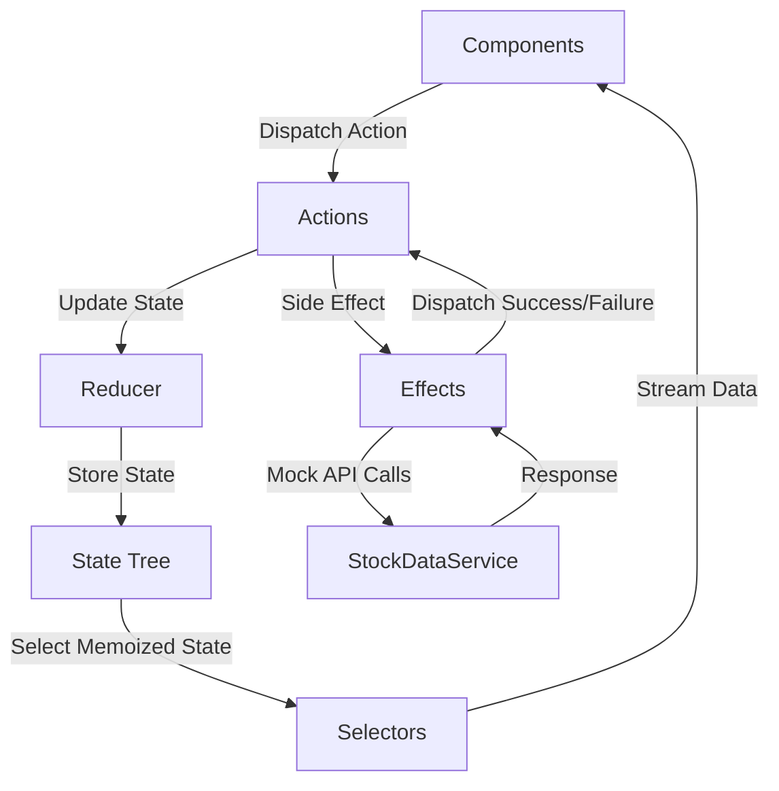

# Aether Stocks - Stock Portfolio Tracker

Aether Stocks is a premium real-time stock portfolio tracker designed for modern investment analysis. Built on Angular 18 with NgRx for state management and styled with an elegant Glassmorphism design system.

## Features
- **Real-time Price Updates**: Periodic price changes (every 5 seconds) handled via NgRx Effects.
- **Holdings Management**: Easily search, add, and remove stocks with instant state updates.
- **Portfolio Summary**: Live total value estimation and daily trend trackers (percentage and dollar changes).
- **Interactive Charting**: 30-day historical trend graph utilizing Chart.js.
- **Glassmorphism Design**: Sleek dark mode aesthetics, blurred panels, and responsive grid layouts.

## Tech Stack
- **Framework**: Angular 18
- **State Management**: NgRx Store, Effects, Entity, DevTools
- **Data Visualization**: Chart.js, ng2-charts
- **Testing**: Cypress (E2E Integration)
- **Containerization**: Docker, Nginx (Alpine)

## Setup & Running Locally

### Installation
Ensure Node.js v18+ is installed:
```bash
npm install --legacy-peer-deps
```

### Running Locally
Run the development server:
```bash
npm start
```
Open `http://localhost:4200/` in your browser.

### Run E2E Tests
To run Cypress tests headlessly:
```bash
npx cypress run
```

## Running with Docker
Use Docker Compose to build and run the production environment:
```bash
docker-compose build
docker-compose up
```
Open `http://localhost/` in your browser.

## NgRx Store Architecture



- **State Shape**: Normalized collection of stocks via `@ngrx/entity`.
- **Selectors**: Memoized selectors to maximize rendering performance.

## Credits
- Developed by **chdsssbaba**
