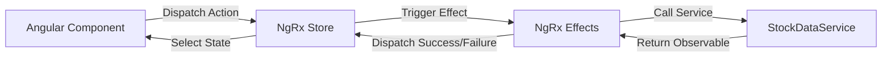

# Architecture Documentation

Aether Stocks uses a decoupled, state-driven architectural pattern utilizing Angular modules and NgRx for state management.

## State Management Decisions
- **NgRx Entity**: Used to manage stock collections with a normalized shape to ensure $O(1)$ lookups and clean updates.
- **OnPush Change Detection**: Employed on container and presentational components to minimize digest cycles and boost UI rendering speed.
- **Memoized Selectors**: Selectors are memoized via `createSelector` to avoid recalculating portfolio values unless individual prices or holdings change.
- **Price Update Effects**: Simulates real-time updates through a periodic timer effect triggering price action dispatches.
