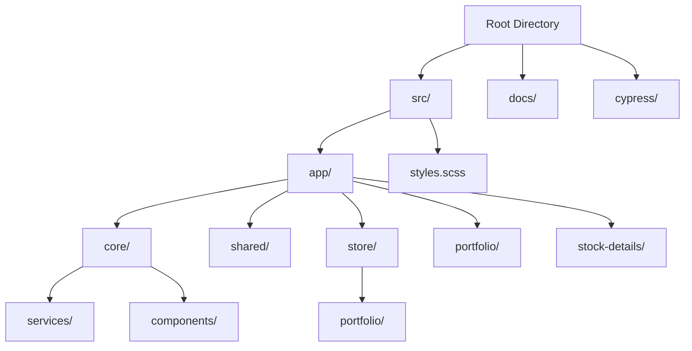

# Project Structure

This document outlines the folder structure of the Aether Stocks tracker application.

## Key Files
- `src/app/core/services/stock-data.service.ts`: Mock API client with simulated delays, search indexing, and real-time updates.
- `src/app/store/portfolio/*`: Complete NgRx store implementation (Actions, Reducers, Effects, Selectors).
- `src/app/portfolio/*`: Dashboard module displaying assets and portfolio summary.
- `src/app/stock-details/*`: Details page with interactive Chart.js line graph.
- `cypress/e2e/portfolio.cy.ts`: End-to-end integration tests.
- `Dockerfile`: Multi-stage Docker config.
- `nginx.conf`: SPA routing configuration.
